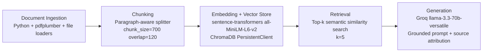

# Project 1 Planning: The Unofficial Guide

> Write this document before you write any pipeline code.
> Your spec and architecture diagram are what you'll use to direct AI tools (Claude, Copilot, etc.) to generate your implementation — the more specific they are, the more useful the generated code will be.
> Update the Retrieval Approach and Chunking Strategy sections if you change your approach during implementation.
> Update this file before starting any stretch features.

---

## Domain

I am building an unofficial guide for **student-reported course and professor experience** (teaching style, grading strictness, exam difficulty, feedback quality, and workload). This knowledge is valuable because official catalogs describe course objectives but usually omit practical survival details students care about. It is hard to find through official channels because it is spread across informal sources and written in inconsistent language.

---

## Documents

<!-- List your specific sources: URLs, subreddit names, forum threads, or file descriptions.
     Aim for at least 10 sources that together cover different subtopics or perspectives within your domain. -->

| # | Source | Description | URL or location |
|---|--------|-------------|-----------------|
| 1 | RMP Intro Programming reviews set 1 | RateMyProfessors comments focused on exam format and difficulty | documents/rmp_intro_programming_reviews_01.txt |
| 2 | RMP Data Structures reviews set 1 | RateMyProfessors comments about weekly workload and assignment intensity | documents/rmp_data_structures_reviews_01.txt |
| 3 | RMP Algorithms reviews set 1 | RateMyProfessors comments about grading consistency and curves | documents/rmp_algorithms_reviews_01.txt |
| 4 | Reddit CSMajors thread set 1 | Thread excerpts discussing how different CS professors teach | documents/reddit_csmajors_professor_advice_01.txt |
| 5 | Reddit University subreddit thread set 1 | Thread excerpts on choosing professors and sections | documents/reddit_university_course_selection_01.txt |
| 6 | Department unofficial FAQ copy | Student-maintained FAQ notes about class policies and expectations | documents/unofficial_department_faq.md |
| 7 | Discord senior advice transcript 1 | Anonymized senior advice on how to succeed in core CS courses | documents/discord_senior_advice_01.txt |
| 8 | Campus tutoring feedback notes | Student comments on TA office hours and tutoring usefulness | documents/tutoring_center_feedback_01.txt |
| 9 | Assignment turnaround discussion set 1 | Collected comments about grading turnaround times | documents/assignment_turnaround_discussion_01.txt |
| 10 | Course workload comparison notes | Student-reported weekly hour estimates by course | documents/course_workload_comparison_01.txt |

Notes for collection quality:
- Prioritize diversity: mix review-style, discussion-style, and long-form advice documents.
- Keep each source focused enough to preserve context after chunking.
- Save cleaned text snapshots in `documents/` as `.txt`/`.md`/`.pdf`.

---

## Chunking Strategy

<!-- How will you split documents into chunks?
     State your chunk size (in tokens or characters), overlap size, and explain why those
     numbers fit the structure of your documents.
     A review-heavy corpus warrants different chunking than a long FAQ. -->

**Chunk size:** 700 characters

**Overlap:** 120 characters

**Reasoning:** Most student reviews are short and opinion-heavy, while some guides are multi-paragraph. A medium chunk size keeps each chunk semantically meaningful without merging unrelated points. Overlap helps preserve facts that cross boundaries (for example, professor + exam policy details split across two adjacent paragraphs). I will inspect sample chunks and tune size if retrieval is too broad (chunks too large) or too fragmented (chunks too small).

---

## Retrieval Approach

<!-- Which embedding model are you using (e.g., all-MiniLM-L6-v2 via sentence-transformers)?
     How many chunks will you retrieve per query (top-k)?
     If you were deploying this for real users and cost wasn't a constraint, what tradeoffs
     would you weigh in choosing a different embedding model — context length, multilingual
     support, accuracy on domain-specific text, latency? -->

**Embedding model:** `all-MiniLM-L6-v2` via `sentence-transformers`

**Top-k:** 5

**Production tradeoff reflection:** For production, I would compare larger embedding models for improved semantic fidelity on nuanced opinion text, especially if student language contains abbreviations and slang. I would evaluate multilingual support (if reviews are mixed-language), latency requirements for interactive querying, context-length alignment with chunking policy, and local-hosted vs API-hosted deployment constraints (privacy, cost stability, and scaling).

---

## Evaluation Plan

<!-- List your 5 test questions with their expected correct answers.
     Questions should be specific enough that you can judge whether the system's response
     is right or wrong. "What are good dining halls?" is too vague.
     "What do students say about wait times at [dining hall name] during lunch?" is testable. -->

| # | Question | Expected answer |
|---|----------|-----------------|
| 1 | According to `documents/rmp_intro_programming_reviews_01.txt`, what do students report about Professor Allen's midterms and final exam focus? | Midterms include 'trick' or application-style questions that often reuse homework wording and reward pattern recognition; the final is cumulative and heavily weighted. Students recommend practicing homework and attending lectures. |
| 2 | Based on `documents/course_workload_comparison_01.txt` and `documents/rmp_data_structures_reviews_01.txt`, how many weekly hours do students typically report for Data Structures? | Students report about 8–15 hours per week for Data Structures (common range 8–12, with peaks up to ~15 during busy weeks). |
| 3 | From `documents/assignment_turnaround_discussion_01.txt` and `documents/unofficial_department_faq.md`, what do students report about grading turnaround times in Professor Kim's course? | Turnaround is mixed: some report quick grading (around 3–5 days) with useful comments, while others report delays of 2+ weeks and sparse feedback. |
| 4 | Do students in `documents/reddit_csmajors_professor_advice_01.txt` and `documents/rmp_intro_programming_reviews_01.txt` recommend attending lectures to prepare for exams? | Yes — students commonly recommend attending lectures and copying down examples because exams often draw directly from lecture examples and review sessions. |
| 5 | Is there any information in the corpus about exam accommodations (extended time, alternate formats) for students with disabilities or neurodiversity? | No information available in the provided documents — the system should respond that the corpus contains no evidence about exam accommodations (this question is expected to fail/return "no information"). |

---

## Anticipated Challenges

<!-- What could go wrong? Name at least two specific risks with reasoning.
     Consider: noisy or inconsistent documents, missing source attribution, off-topic
     retrieval, chunks that split key information across boundaries. -->

1. Noisy source text can pollute retrieval (navigation text, repeated headers, copy artifacts), causing semantically weak chunks.

2. Similar professor/course names can confuse retrieval if metadata is sparse, leading to wrong-source grounding.

3. If key details are split across chunk boundaries, retrieval may return partial context and generation can become incomplete.

---

## Architecture

---

## AI Tool Plan

<!-- For each part of the pipeline below, describe:
     - Which AI tool you plan to use (Claude, Copilot, ChatGPT, etc.)
     - What you'll give it as input (which sections of this planning.md, which requirements)
     - What you expect it to produce
     - How you'll verify the output matches your spec

     "I'll use AI to help me code" is not a plan.
     "I'll give Claude my Chunking Strategy section and ask it to implement chunk_text()
     with my specified chunk size and overlap" is a plan. -->

**Milestone 3 — Ingestion and chunking:** Use Copilot with the Domain, Documents, and Chunking Strategy sections as prompt context to generate loaders/cleaners/chunker. Expected output: reusable functions for file loading, text cleaning, chunk creation, and sample chunk inspection. Verification: manually inspect at least 5 chunks for readability, standalone meaning, and absence of HTML artifacts.

**Milestone 4 — Embedding and retrieval:** Use Copilot with Retrieval Approach + Architecture diagram to generate index build and retrieval functions (embedding generation, ChromaDB upsert/query, source metadata handling). Expected output: scriptable indexing step and query function that returns chunk text, source, and distance. Verification: run 3 evaluation questions and confirm top results are relevant with distance typically below 0.5.

**Milestone 5 — Generation and interface:** Use Copilot with grounding requirement and desired response schema to generate Groq-backed answer generation and Gradio UI wiring. Expected output: end-to-end function returning answer + sources, plus web interface. Verification: test in-domain and out-of-domain questions; ensure out-of-scope prompts return insufficient-information response.
